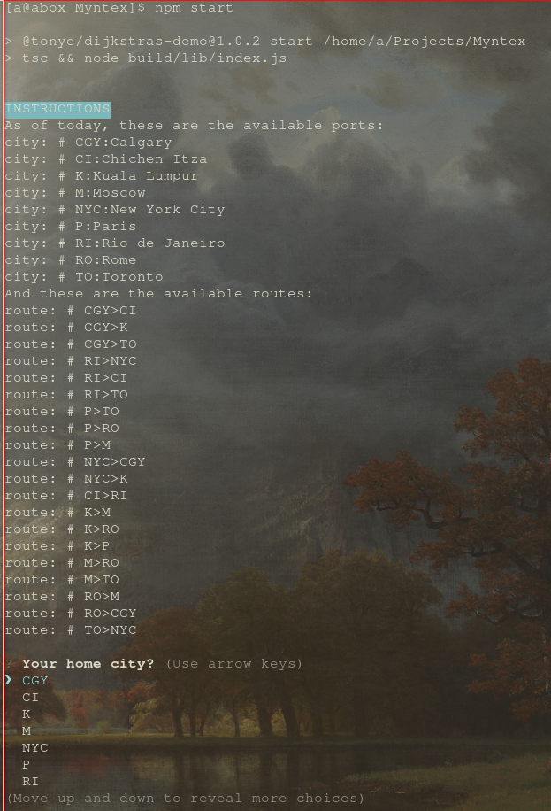
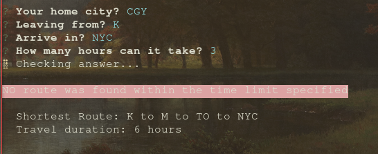
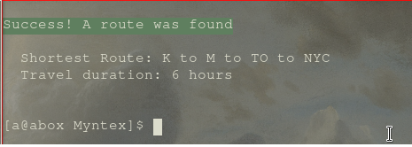

# Demo of Dijkstra's Algo

## Demo
  
  
  

## Travel Permutations From Origin to Destination:
  - Rio de Janeiro
    - New York City
    - Chichen Itza
    - Toronto
  - Paris
    - Toronto
    - Rome
    - Moscow
  - New York City
    - Calgary
    - Kuala Lumpur
  - Calgary
    - Chichen Itza
    - Kuala Luumpur
    - Toronto
  - Chichen Itza
    - Rio de Janeiro
  - Kuala Lumpur
    - Moscow
    - Rome
    - Paris
  - Moscow
    - Rome
    - Toronto
  - Rome
    - Moscow
    - Calgary
  - Toronto
    - New York City
## Requirements
  - Travelling from one city to another, with each of the routes listed above, takes exactly 1 hour.
  - If you want to travel to a city not available at your current city terminal, you would have to transfer
  - Each transfer route also takes exactly 1 hour
  - After each teleport, you arrive at a different city
  - A customs check is required for every leg of your journey, even if you are transferring or if you have reached your final destination
  - If the city you arrive in is NOT your home city, the customs process to verify your travel documents adds an extra hour onto that leg of your journey.
  - Basic command line program for its customers to determine if a journey from a starting city to a destination city is possible in a provided number of hours.
  - Provide information about each city
    - Every new entry will get a new line and it will be formatted “CityID:City Name”.
  - Provide the routing information for each city to indicate which destinations can be reached.
    - Every new entry will get a new line and it will be formatted “CityID>DestinationCityID”.
  - Finally, the customer loop will take the set of customer parameters for calculating if a route is possible from one city to another.
  - Identify if the route was successful or no route could be found in the time limit provided
  - Display list of cities that will be visited from start to finish. List out each city in order and the total travel time
  - Display the shortest route possible between the two cities

## Concessions
- App is bloated due UI packages installed
- Unit testing foregone